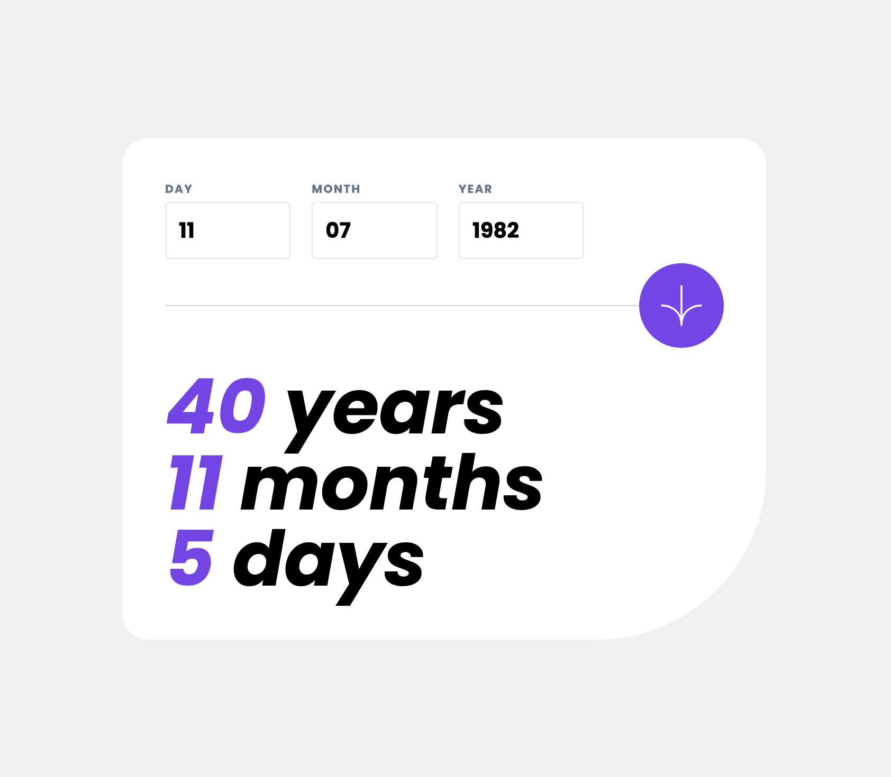

# Frontend Mentor - Age calculator app solution

This is a solution to the [Age calculator app challenge on Frontend Mentor](https://www.frontendmentor.io/challenges/age-calculator-app-dF9DFFpj-Q). Frontend Mentor challenges help you improve your coding skills by building realistic projects.

## Table of contents

- [Overview](#overview)
  - [The challenge](#the-challenge)
  - [Screenshot](#screenshot)
  - [Links](#links)
- [My process](#my-process)
  - [Built with](#built-with)
  - [What I learned](#what-i-learned)
  - [Useful resources](#useful-resources)
- [Author](#author)

## Overview

### The challenge

Users should be able to:

- View an age in years, months, and days after submitting a valid date through the form
- Receive validation errors if:
  - Any field is empty when the form is submitted
  - The day number is not between 1-31
  - The month number is not between 1-12
  - The year is in the future
  - The date is invalid e.g. 31/04/1991 (there are 30 days in April)
- View the optimal layout for the interface depending on their device's screen size
- See hover and focus states for all interactive elements on the page

### Screenshot

### Links

- Live Site URL: [Add live site URL here](https://your-live-site-url.com)

## My process

### Built with

- Flexbox + CSS Grid
- Mobile-first workflow
- [React](https://reactjs.org/) - JS Library
- [React Hook Form](https://www.react-hook-form.com/) - Form Library
- [Tailwind](http://tailwindcss.com/) - Utility First CSS Framework

### What I learned

#### Forms

Out of the box, working with forms in React can be a bit of a pain. As a result, I used this as an opportunity to try out the React Hook Form library. It is simple to use, prevents polluting components with numerous peices of form state, and has easy to use built in validation. Overall, I think that using React Hook Form made this project go more smoothly and I would reach for it again when building forms whether simple or complex.

#### Tailwind

I've been interested in trying Tailwind for a while and thought that this would be a good project to test it out on. While I can't say that I'm completely converted, I did enjoy using it. I found that being able to quickly add styles to elements without leaving my markup was a nice change from the usual styling workflow, and the docs were a pleasure to use. Additionally, using the same styles in more than a couple placesacted as a good indication that you may want to create a new component to avoid duplicated styles and increase reusability.

### Useful resources

- [Tailwind Docs](https://tailwindcss.com/docs/installation) - The Tailwind docs are robust and easy to navigate.
- [React Hook Form Docs](https://www.react-hook-form.com/get-started/) - Simple examples help get you up and running with React Hook Form in no time.

## Author

- Frontend Mentor - [@jacksonmcdaniel](https://www.frontendmentor.io/profile/jacksonmcdaniel)
